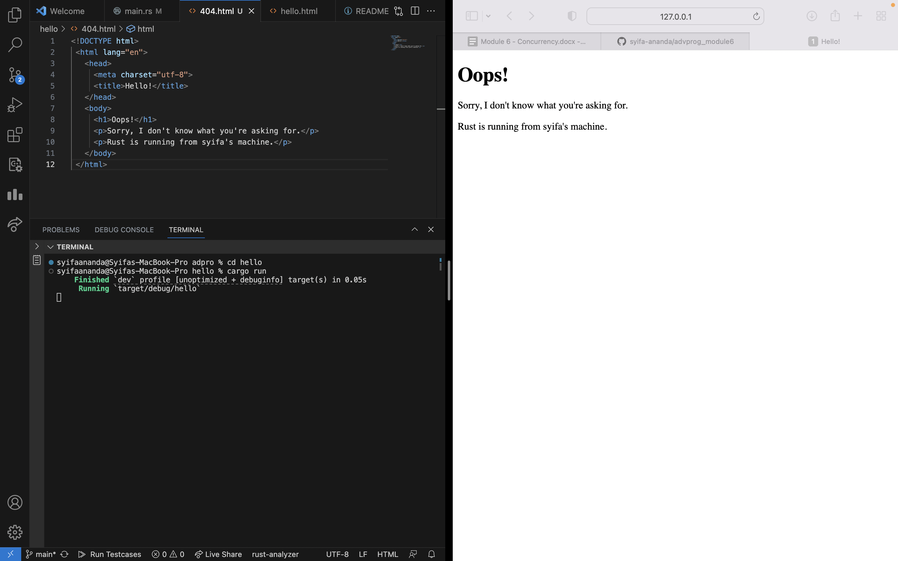

## Commit 1 Reflection

In this milestone, I built a simple Rust web server that listens for TCP connections at `127.0.0.1:7878`. I started by printing a message each time a client connected, then moved the connection handling into its own function to keep the code organized. I also learned how to deal with multiple requests and fix small warnings. This hands-on experience made the inner workings of a web server much clearer and set the stage for future improvements.

## Commit 2 Reflection

This milestone focused on returning actual HTML to the browser. I updated the `handle_connection` method to build a proper HTTP response and serve a simple `hello.html` file. It was a great introduction to how HTTP responses work (status line, headers, body) and how Rust can read files and send them back to the client.

## Commit 3 Reflection

In this milestone, I refined the server to respond based on the requested path. By parsing the first line of the HTTP request, the code checks if it’s “GET / HTTP/1.1” to serve the main page with a 200 OK status. Anything else returns a 404 NOT FOUND. I also combined setting the `status_line` and `filename` into one step, eliminating duplicated response code. This makes the server logic clearer and more maintainable.

## Commit 4 Reflection

In this milestone, I simulated a slow response by adding a delay in request handling. Testing multiple browser windows showed how a single-threaded server blocks all other requests when one is delayed. 